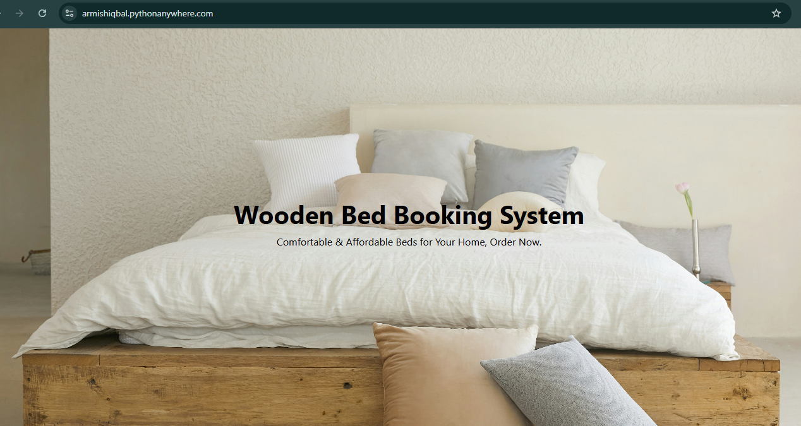
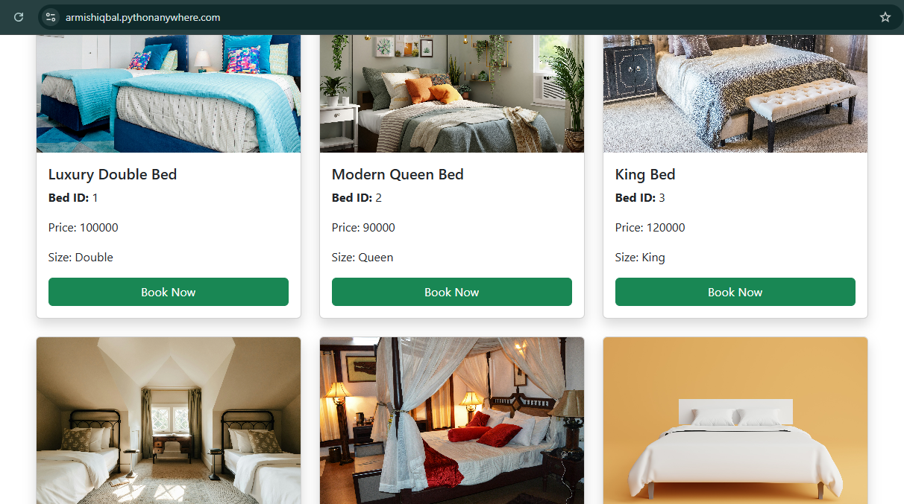
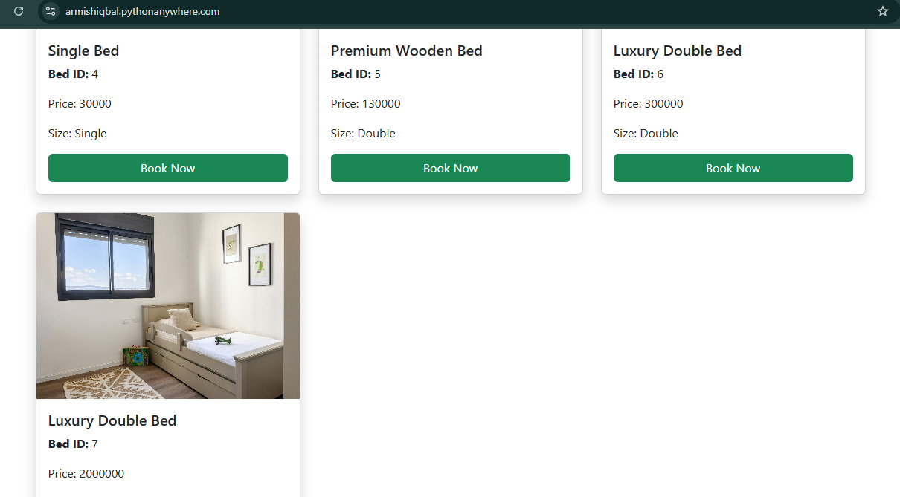
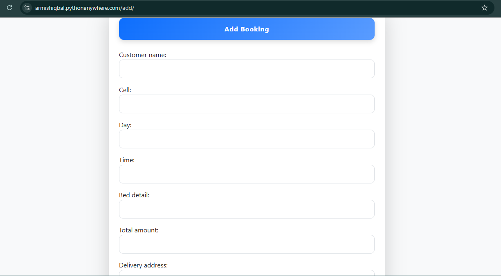
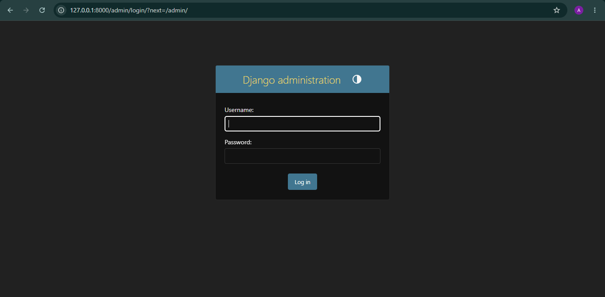
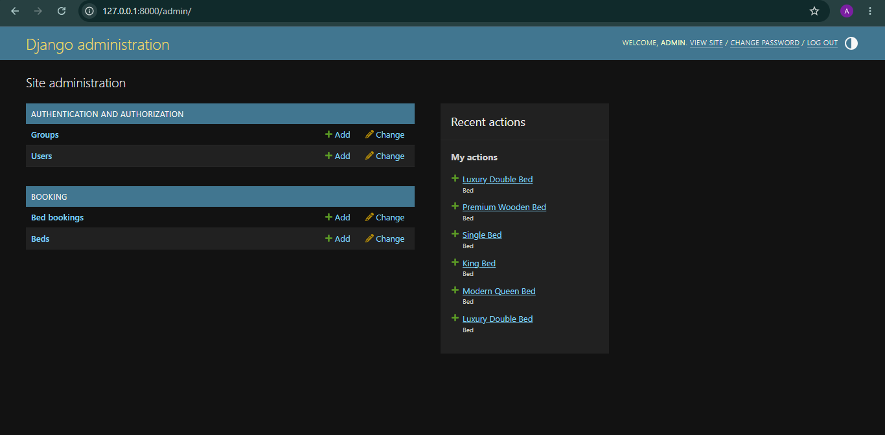

# 🛏️ Wooden Bed Booking System

[](https://www.python.org/)
[](https://www.djangoproject.com/)
[](https://www.django-rest-framework.org/)
[](https://www.sqlite.org/)
[](LICENSE)

A web-based booking management application developed using **Django** and **Django REST Framework (DRF)**. The system allows customers to explore comfortable wooden beds, book online with real-time order submission, and enables administrators to manage bookings, inventory, and bed models through the Django Admin Panel and RESTful API endpoints.

---

## 🌟 Key Features

* **Bed Catalog Showcase**: Display wooden beds with high-resolution imagery, size categories (Single, Double, Queen, King), price specifications, and unique Bed IDs.
* **Instant Online Booking**: Clean, intuitive customer booking form capturing customer name, cell number, preferred day/time, selected bed, total amount, and delivery address.
* **CRUD Management via Django Admin**: Comprehensive administrative dashboard to view, filter, add, update, and remove beds and customer reservations.
* **RESTful API Architecture**: Complete Django REST Framework API endpoints for programmatic CRUD operations and third-party integrations.
* **Pre-seeded SQLite Database**: Clones ready-to-run with authentic catalog beds and an active administrator account.
* **Responsive UI Design**: Modern interface crafted with Bootstrap 5 and clean CSS styling across desktop and mobile screens.

---

## 🛠️ Technologies Used

* **Backend**: Python, Django 4.2+, Django REST Framework (DRF)
* **Frontend**: HTML5, CSS3, JavaScript, Bootstrap 5, Django Template Engine
* **Database**: SQLite3 (Django ORM)
* **Architecture**: MVT (Model-View-Template) + RESTful API

---

## 📁 Project Structure

```text
Wooden-Bed-Booking-System/
│
├── WoodenBedBooking/         # Main Django project package
│   ├── __init__.py
│   ├── settings.py           # Application settings & installed apps
│   ├── urls.py               # Root URL configuration
│   ├── wsgi.py               # WSGI server entry point
│   └── asgi.py               # ASGI server entry point
│
├── RestApp/                  # Core booking application
│   ├── migrations/           # Database migration files
│   │   ├── __init__.py
│   │   └── 0001_initial.py
│   ├── __init__.py
│   ├── admin.py              # Django admin registrations
│   ├── apps.py               # App configuration (Booking)
│   ├── models.py             # Bed & Booking data models
│   ├── serializers.py        # Django REST Framework serializers
│   ├── urls.py               # Application & API routes
│   └── views.py              # Web views & DRF API view classes
│
├── templates/                # Frontend HTML templates
│   ├── base.html             # Base layout with navigation & footer
│   ├── home.html             # Bed catalog & hero showcase
│   ├── add_booking.html      # Customer booking form
│   └── booking_success.html  # Order confirmation receipt
│
├── static/                   # Static assets
│   ├── css/
│   │   └── style.css         # Custom stylesheet
│   └── images/               # Product bed images & hero banners
│
├── screenshots/              # System screenshots & UI previews
│   ├── home.png
│   ├── bookingform.png
│   ├── adminform.png
│   ├── dbadministration.png
│   ├── bedimages.png
│   └── bedimage.png
│
├── manage.py                 # Django management CLI script
├── db.sqlite3                # Pre-seeded SQLite database
├── requirements.txt          # Python dependencies
└── README.md                 # Project documentation
```

---

## 🚀 Installation & Quick Start

### 1. Clone the repository
```bash
git clone https://github.com/armishiqbal/Wooden-Bed-Booking-System.git
cd Wooden-Bed-Booking-System
```

### 2. Create and activate a virtual environment
```bash
# macOS / Linux:
python3 -m venv venv
source venv/bin/activate

# Windows:
python -m venv venv
venv\Scripts\activate
```

### 3. Install dependencies
```bash
pip install -r requirements.txt
```

### 4. Run database migrations (Already pre-seeded)
```bash
python manage.py migrate
```

### 5. Start the development server
```bash
python manage.py runserver
```

Visit the application in your browser:
* **Catalog & Home**: [http://127.0.0.1:8000/](http://127.0.0.1:8000/)
* **Add Booking**: [http://127.0.0.1:8000/add/](http://127.0.0.1:8000/add/)
* **Admin Panel**: [http://127.0.0.1:8000/admin/](http://127.0.0.1:8000/admin/)
* **REST API**: [http://127.0.0.1:8000/RestApp/bookings/](http://127.0.0.1:8000/RestApp/bookings/)

---

## 🔐 Default Credentials

| Portal | Username | Password | Access URL |
| :--- | :--- | :--- | :--- |
| **Django Admin** | `admin` | `admin` | `/admin/` |

---

## 📡 REST API Endpoints

| Method | Endpoint | Description |
| :--- | :--- | :--- |
| **GET** | `/RestApp/bookings/` | Retrieve a list of all customer bookings |
| **POST** | `/RestApp/bookings/` | Submit and create a new customer booking |
| **GET** | `/RestApp/bookings/<id>/` | Retrieve details of a specific booking by ID |
| **PUT** | `/RestApp/bookings/<id>/` | Update an existing booking |
| **DELETE** | `/RestApp/bookings/<id>/` | Delete a booking record |
| **GET** | `/RestApp/beds/` | Retrieve full list of available beds in catalog |

---

## 📸 Screenshots

### Home Page & Catalog


### Bed Inventory & Specifications


### Additional Bed Models


### Add Booking Form


### Admin Login


### Django Database Administration


---

## 🌐 Live Demo

* **PythonAnywhere**: [https://armishiqbal.pythonanywhere.com/](https://armishiqbal.pythonanywhere.com/)

---

## 👩‍💻 Author

**Armish Iqbal**  
BS Computer Science Student  
Islamia University Bahawalpur  
* **GitHub**: [@armishiqbal](https://github.com/armishiqbal)
